# Practical Cipher Analysis

<!-- Folder Number 265 -->

This assignment consists of 4 ciphertexts, each of them used one of the ciphers below. The task is to determine which ciphertext used which cipher, then extract the original plaintext from each ciphertext.

To solve the ciphers we will use [CrypTool](https://www.cryptool.org/en/).

---

## Vigenère Analysis

We start by analyzing all the texts using the autocorrelation tool in *CrypTool*. Thisgives the following results (in order: ciphertext 0, 1, 2 and 3):

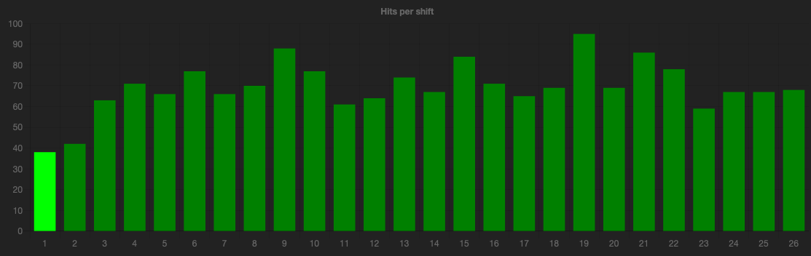
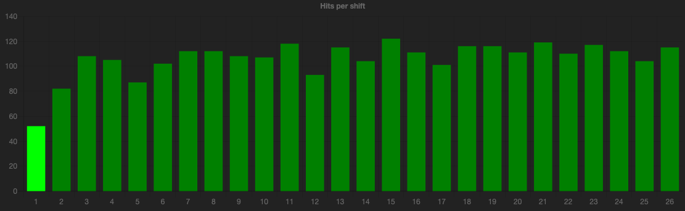
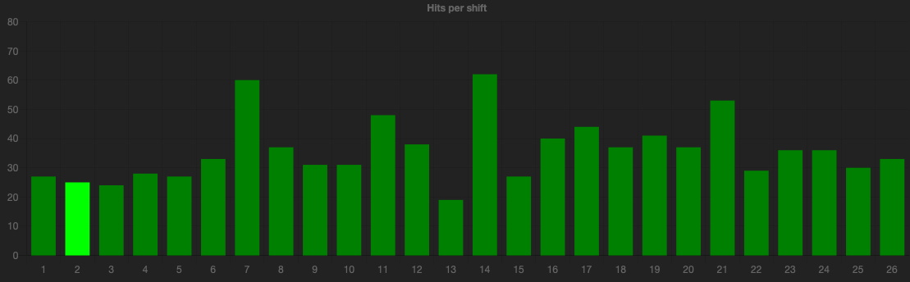
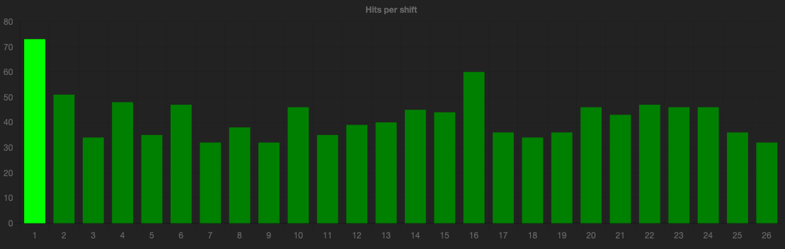

Based on these results i estimate the Vigenère ciphertext to be [Ciphertext 2](ciphertexts/2.txt). As we see a clear pattern where the correlation spikes at 7, 14 and 21 (multiples of 7). Using the Viegenere Analysis tool to find the key we get:

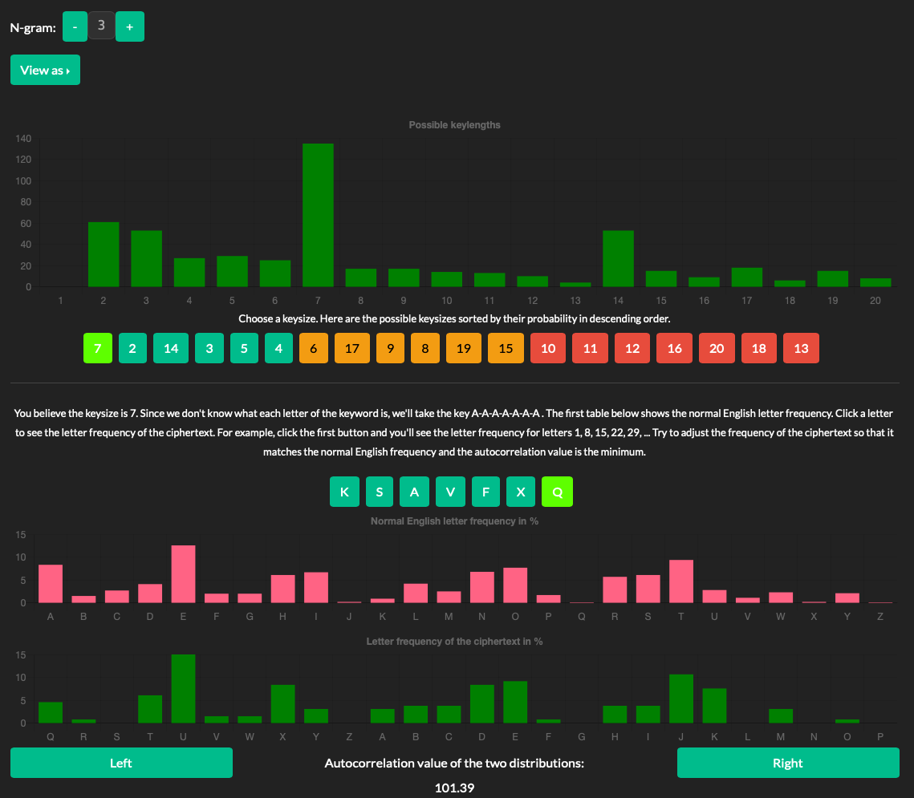

In other words using the key **```KSAVFXQ```** we get the plaintext as:

```txt
ROSS STOOD CAUTIOUSLY AGAINST THE WALL OF HIS DARKENED ROOM, HIS HEAD
TURNED TOWARD THE SLIGHTLY OPEN DOOR. A SLIGHT SHUFFLING SOUND HAD
AWAKENED HIM, AND HE WAS NOW AS READY AS A CAT BEFORE HER SPRING. BUT HE
DID NOT HURL HIMSELF AT THE FIGURE NOW EASING THE DOOR FARTHER OPEN. HE
WAITED UNTIL THE VISITOR WAS APPROACHING THE BUNK BEFORE HE SLID ALONG
THE WALL, CLOSING THE DOOR AND PUTTING HIS SHOULDERS AGAINST IT.
"WHAT'S THE PITCH?" ROSS DEMANDED IN A WHISPER.
THERE WAS A RAGGED BREATH, MAYBE TWO, THEN A LITTLE LAUGH OUT OF THE
DARK. "YOU ARE READY?" THE VISITOR'S ACCENT LEFT NO DOUBT AS TO HIS
IDENTITY. KURT WAS PAYING HIM THE PROMISED VISIT.
"DID YOU THINK THAT I WOULDN'T BE?"
"NO." THE DIM FIGURE SAT WITHOUT INVITATION ON THE EDGE OF THE BUNK. "I
WOULD NOT BE HERE OTHERWISE, MURDOCK. YOU ARE PLENTY ... HAVE PLENTY ON
THE BALL. YOU SEE, I HAVE HEARD THINGS ABOUT YOU. LIKE ME, YOU WERE
TRICKED INTO THIS GAME. TELL ME, IS IT NOT TRUE THAT YOU SAW HARDY
"YOU HEAR A LOT, DON'T YOU?" ROSS WAS NONCOMMITTAL.
"I HEAR, I SEE, I LEARN MORE THAN THESE BIG MOUTHS, LIKE THE MAJOR WITH
ALL HIS DO'S AND DON'TS. THAT I CAN TELL YOU! YOU SAW HARDY. DO _YOU_
WANT TO BE A HARDY?"
"IS THERE ANY DANGER OF THAT?"
```
Which is from **The Time Traders by Andre Norton**.

---

## Substitution Analysis

We are now left with ciphertexts **0**, **1** and **3**. To find the ciphertext that used substitution we use frequency analysis for 3-grams in *CrypTool*, the correct solution should have a large spike that will correlate to the word **THE**. Using 3-gram frequency analysis on the remaining ciphertexts we get (in order 0, 1 and 3):

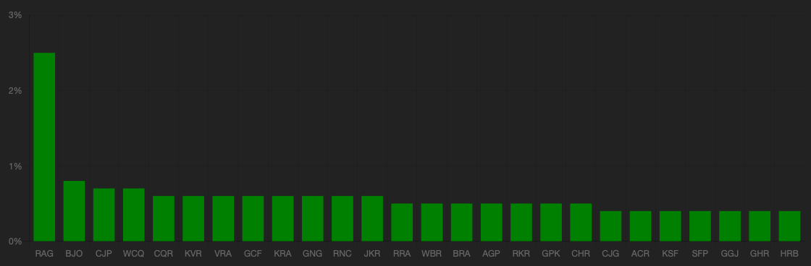
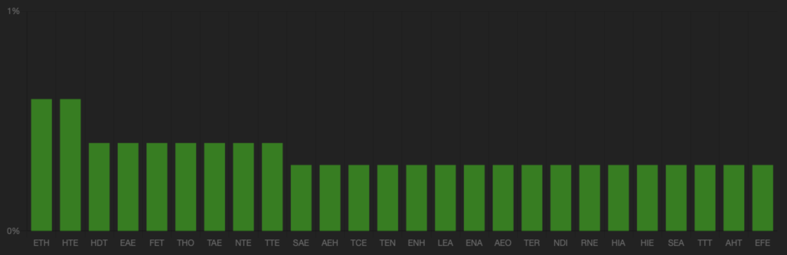
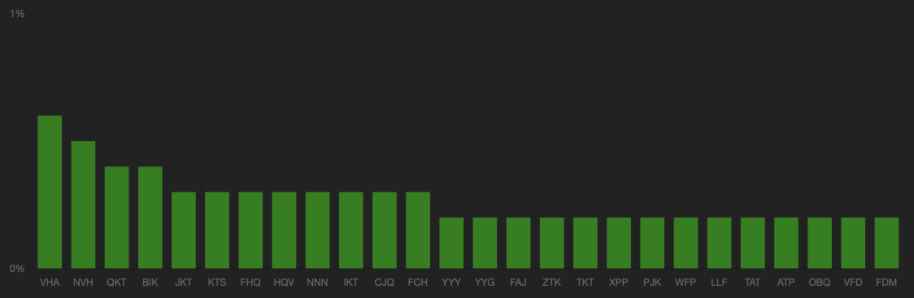

As we can see, [Ciphertext 0](ciphertexts/0.txt) is the only text with a large spike of length 3 characters, we can therefore assume that this 3-letter sequence corresponds to the word **THE**, for ciphertext 0 this is substituted with **RAG**.


---

## Transposition Analysis

Once again we perform a frequency analysis, however, this time we are looking for a 1-gram analysis that yields something approximately equal to the regular distribution of letters in the english language. The analysis below is in order ciphertext 1 and 3.

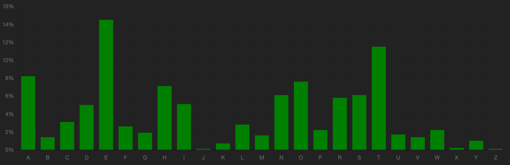
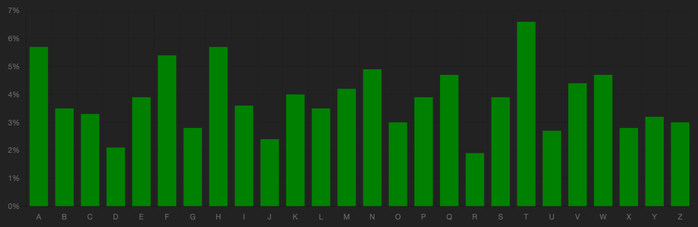

As we can see [Ciphertext 1](ciphertexts/1.txt) is most equal to the regular distribution which means this ciphertext has likely used transposition. To find the plaintext we will use [JCrypTool](https://www.cryptool.org/en/jct/), and we are already given the information that the transposition block has 7 characters.

After rearrangeing the columns to form a readable first row we get:

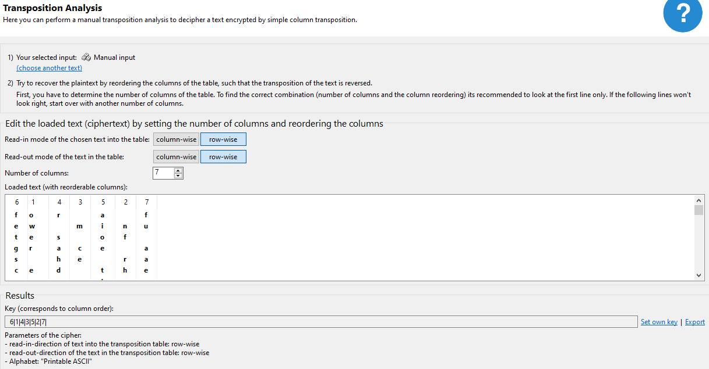

In other words we get the transposition of the columns (transposition key) as: **|6|1|4|3|5|2|7|**

This leaves us with the plaintext:

```txt
for a few minutes of grace as he raced the protesting engine of the heavy machine to its last and greatest effort  The treads of the crawler bit on the steps leading up to the impressive entrance of the tower  There was a second or two before traction caught and then the driver s heart snapped back into place as the machine tilted its nose up and headed straight for the portal  They struck the closed doors with a shock which almost hurled them from their seats  But that engraved bronze expanse had not been cast to withstand a head on blow from a heavy duty off world vehicle and the leaves tore apart letting them into the wide hall beyond  Take Hovan and make for the riser   For the second time it was Dane who gave the orders   I have a blocking job to do here   He expected every second to feel the bit of a police blaster somewhere along his shrinking body could even a space suit protect him now  At the far end of the corridor were the attendants and visitors trapped in the building who had fled in an attempt to find safety at the crashing entrance of the crawler These flung themselves flat at the steady advance of the two space suited Traders who supported the unconscious Medic between them  using the low powered anti grav units on their belts to take most of his weight so each had one hand free to hold a sleep rod  And they did not hesitate to use those weapons  spraying the Gsn
```

---

## Hill Cipher Analysis

We are now only left with [Ciphertext 3](ciphertexts/3.txt), which we should be able to solve using Hill Cipher Analysis.

By using the frequency analysis we get the following results for 2-gram pairs:

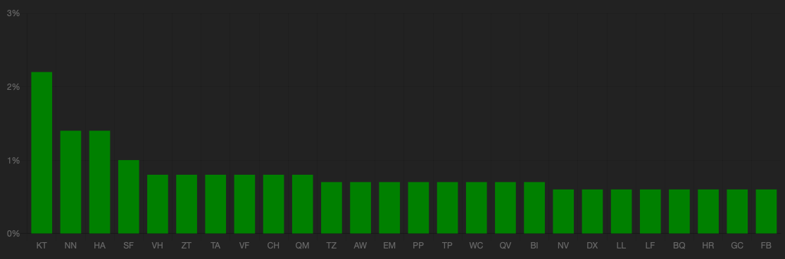

Using these results we check for mathes of **TH** and **HE** by looking at matches for these in the frequency diagram.

Below we have highlighted the most frequent **KT**, and we can see that it would be a pretty good match for **HE**.

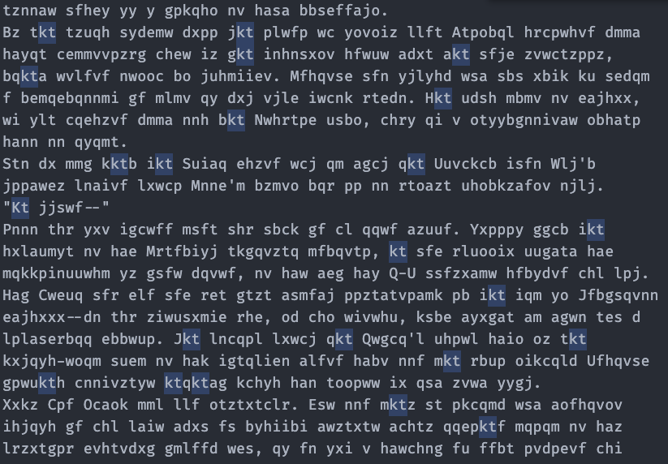

Further when checking **HA** we notice how this could be a pretty good match for **TH**.

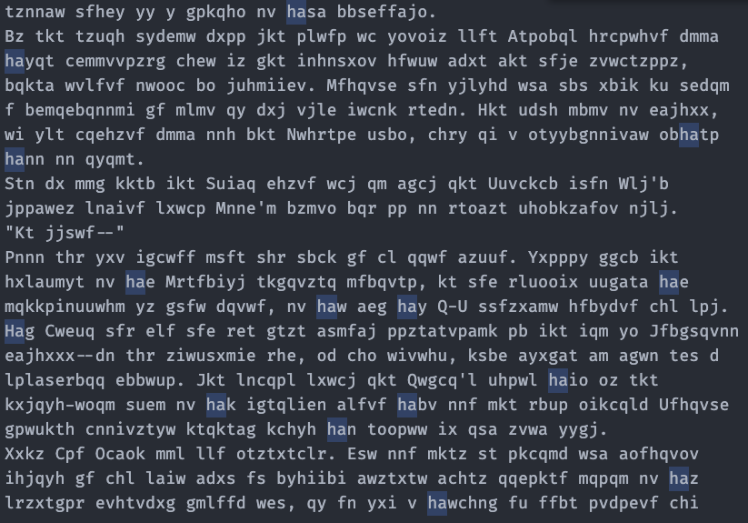

we then use this to find *K*:

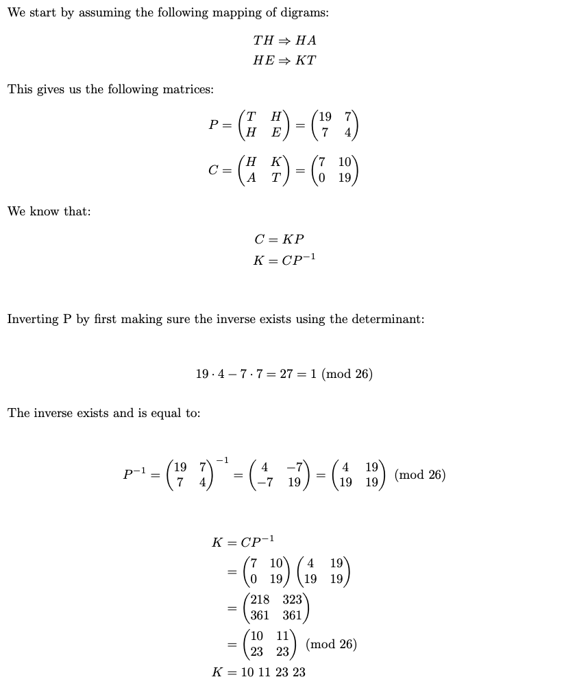

We get the key: **10 11 23 23** Using this as the key in *CrypTool* to find the plaintext gives us:

```txt
change hands as a result of this encounter.
As the chief priest gave the order to engage both Terrans advanced from
their respective ends of the fighting space with the half crouching,
light footed tread of spacemen. Jellico had pulled his net into as close
a resemblance to rope as its bulk would allow. The very type of weapon,
so far removed from any the Traders knew, made it a disadvantage rather
than an asset.
But it was when the Eysie moved out to meet the Captain that Rip's
fingers closed about Dane's upper arm in an almost paralyzing grip.
"He knows--"
Dane had not needed that bad news to be made vocal. Having seen the
exploits of the Salariki duelists earlier, he had already caught the
significance of that glide, of the way the I-S champion carried his net.
The Eysie had not had any last minute instruction in the use of Sargolian
weapons--he had practiced and, by his stance, knew enough to make him a
formidable menace. The clamor about the Queen's party rose as the
battle-wise eyes of the clansmen noted that and the odds against Jellico
reached fantastic heights while the hearts of his crew sank.
Only Van Rycke was not disturbed. Now and then he raised his smelling
bottle to his nose with an elegant gesture which matched those of the
befurred nobility around him, as if not a thought of care ruffled his
```
